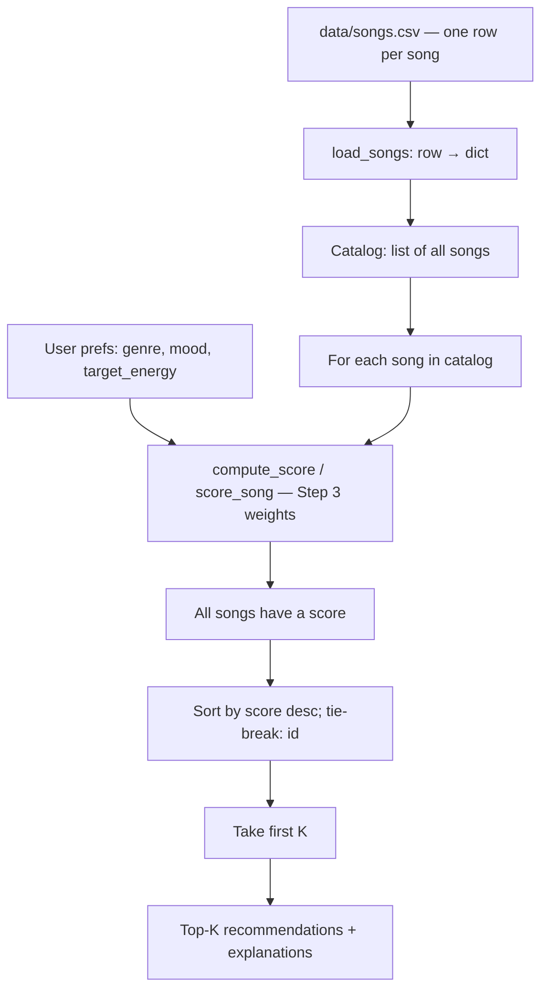
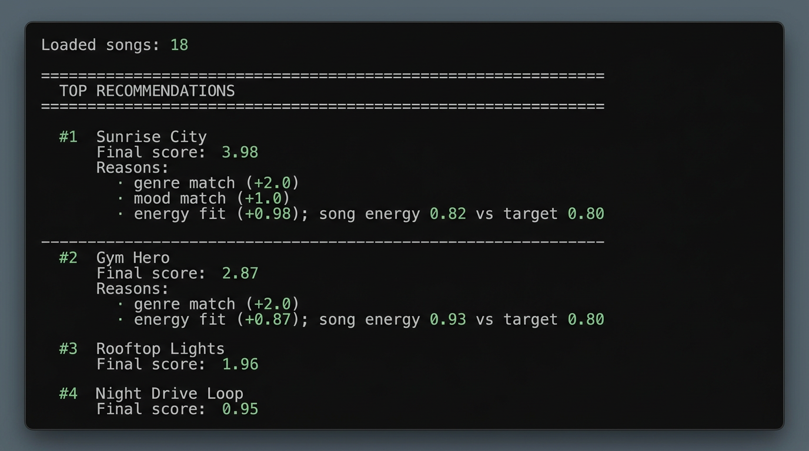

# 🎵 Music Recommender Simulation

## Project Summary

In this project you will build and explain a small music recommender system.

Your goal is to:

- Represent songs and a user "taste profile" as data
- Design a scoring rule that turns that data into recommendations
- Evaluate what your system gets right and wrong
- Reflect on how this mirrors real world AI recommenders

Replace this paragraph with your own summary of what your version does.

---

## How The System Works

Large streaming services combine massive behavioral data (what millions of people play, skip, and save) with content signals (audio analysis, text, and metadata) in multi-stage pipelines: generate candidates, score or rank them with learned models, then often re-rank for diversity and freshness. This project does not use collaborative filtering or live telemetry; it is a **transparent, content-based simulation** on a tiny catalog. It **prioritizes interpretability**: each recommendation comes from explicit rules that match **song attributes** to a **user taste profile**, so you can trace *why* a track was suggested.

**`Song` features (simulation):** `id`, `title`, `artist`, `genre`, `mood`, `energy`, `tempo_bpm`, `valence`, `danceability`, `acousticness` — loaded from `data/songs.csv` for the functional API (`load_songs`) and represented as `Song` objects for the class-based API.

**`UserProfile` fields:** `favorite_genre`, `favorite_mood`, `target_energy` (desired energy on a 0–1 scale), `likes_acoustic` (reserved on the profile for API alignment and future extensions; **current scoring** uses genre, mood, and energy only).

**Scoring and ranking:** For each user–song pair, the scoring rule produces one number; the ranking rule sorts **all** loaded songs by that score (highest first), with ties broken by ascending `id`. The first `k` rows are the **top‑K recommendations**. Short **explanations** summarize genre/mood matches and energy fit.

### Step 3: Recommendation logic

The program uses a **single linear content-based score** per song, then recommends by **sorting** (no collaborative or session data).

#### Algorithm recipe (finalized)

**Inputs**

- From the user: `favorite_genre`, `favorite_mood`, `target_energy` ∈ [0, 1] (and `likes_acoustic` for future use).
- From each song: `genre`, `mood`, `energy` (other CSV columns are available for future extensions).

**Scoring rule (higher = better fit)**

1. **Genre match** — add **2.0** if `song.genre` equals `favorite_genre` after trim + **case-insensitive** comparison, else **0**.
2. **Mood match** — add **1.0** if `song.mood` equals `favorite_mood` (same normalization), else **0**.
3. **Energy fit** — add a value in **[0, 1]** measuring closeness to the target (not “higher energy is always better”):  
   `e = max(0, min(1, 1 - |song.energy - target_energy|))`.

**Combine**

`score = 2.0 * [genre match] + 1.0 * [mood match] + e`  
Maximum score **4.0** when genre and mood match and energy equals the target.

**Ranking rule**

Compute `score` for **every** song in the catalog, sort by `score` descending (tie-break: lower `id` first), return the first `k`.

**Explanations**

For each recommended song, build a short line listing genre/mood matches (if any) and the energy fit, including the numeric similarity and song vs. target energy.

#### Potential biases (expected)

Any fixed rule encodes tradeoffs. This system **weights genre above mood** (2.0 vs 1.0), so it may **over-prioritize genre** and rank a same-genre, weaker mood fit above a **different-genre** track that matches mood and energy very well—e.g. a great “chill” pick in another style may lose to an okay “chill” pick in the user’s favorite genre. **Exact string labels** (no fuzzy synonyms) can miss near-matches like “relaxed” vs “chill.” **Energy** is the only continuous signal; **valence, tempo, danceability, acousticness** are ignored in the score, so two songs with the same genre/mood/energy tie on the rule even when they feel different. **Small catalogs** amplify **representation bias**: genres or moods with few rows rarely win the top slot. **Tie-breaking by `id`** is arbitrary and can quietly favor lower-numbered tracks. Together, these are useful classroom examples of how “transparent” recommenders can still skew outcomes.

### Step 4: Visualize the design

The flowchart below matches the implementation: every CSV row becomes one catalog entry, each song is scored with the same user prefs, then the full catalog is sorted and truncated to top `k`.



### Step 5: Document your plan

The **project plan** and **written design** live in this section so you do not need a separate plan file.

**Goals**

- Load the catalog once from CSV into structured rows.
- Score **each** song with the same rule for a given user.
- Rank globally and return the top `k` with human-readable reasons.

**Pipeline (Input → Process → Output)**

1. **Input** — User preferences (`favorite_genre`, `favorite_mood`, `target_energy`) plus the on-disk catalog `data/songs.csv`.
2. **Process** — `load_songs` parses every row into a dict (or `Song` in the OOP path). For **each** song, `score_song` / `compute_score` applies the Step 3 rule. One row in the file becomes one scored item; no song is skipped.
3. **Output** — Sort all scored songs, take the first `k` → **ranked recommendations** (with score and explanation strings in the functional API).

**How one song moves through the system**

A single CSV row becomes one in-memory song, receives **one** score in the same loop as every other song, participates in the **global** sort, and appears in the final list **if and only if** it lands in the top `k` positions after sorting.

**Implementation map (repo)**

| Piece | Role |
|--------|------|
| `load_songs` | CSV → list of dicts |
| `compute_score` / `score_song` | Shared scoring rule |
| `recommend_songs` | Functional API: rank, top `k`, explanations |
| `Recommender` | OOP API: same scores, returns `Song` list |
| `pytest` | Regression checks on ranking and explanations |

---

## Getting Started

### Setup

1. Create a virtual environment (optional but recommended):

   ```bash
   python -m venv .venv
   source .venv/bin/activate      # Mac or Linux
   .venv\Scripts\activate         # Windows
   ```

2. Install dependencies

```bash
pip install -r requirements.txt
```

3. Run the app:

```bash
python -m src.main
```

### CLI verification (Step 4)

The simulation is **CLI-first**: `src/main.py` loads `data/songs.csv`, scores every song for the default **pop / happy** profile (`target_energy` **0.8**), and prints a framed list with **song title**, **final score**, and **reason** lines from the scoring function.

**Terminal screenshot** (titles, scores, and reasons):



**Text capture** (regenerated with `python -m src.main` → `docs/cli-verification-output.txt`):

```text
Loaded songs: 18

========================================================================
  TOP RECOMMENDATIONS
========================================================================

  #1  Sunrise City
      Final score:  3.98
      Reasons:
        · genre match (+2.0)
        · mood match (+1.0)
        · energy fit (+0.98); song energy 0.82 vs target 0.80

------------------------------------------------------------------------

  #2  Gym Hero
      Final score:  2.87
      Reasons:
        · genre match (+2.0)
        · energy fit (+0.87); song energy 0.93 vs target 0.80

------------------------------------------------------------------------

  #3  Rooftop Lights
      Final score:  1.96
      Reasons:
        · mood match (+1.0)
        · energy fit (+0.96); song energy 0.76 vs target 0.80

------------------------------------------------------------------------

  #4  Night Drive Loop
      Final score:  0.95
      Reasons:
        · energy fit (+0.95); song energy 0.75 vs target 0.80

------------------------------------------------------------------------

  #5  Iron Meridian
      Final score:  0.92
      Reasons:
        · energy fit (+0.92); song energy 0.88 vs target 0.80

========================================================================

```

**Checkpoint:** You have a working Python recommender in `src/recommender.py` that loads CSV rows, computes scores from user preferences, and produces a **ranked, explained** list in the terminal.

### Running Tests

Run the starter tests with:

```bash
pytest
```

You can add more tests in `tests/test_recommender.py`.

---

## Experiments You Tried

Use this section to document the experiments you ran. For example:

- What happened when you changed the weight on genre from 2.0 to 0.5
- What happened when you added tempo or valence to the score
- How did your system behave for different types of users

---

## Limitations and Risks

Summarize some limitations of your recommender.

Examples:

- It only works on a tiny catalog
- It does not understand lyrics or language
- It might over favor one genre or mood

You will go deeper on this in your model card.

---

## Reflection

Read and complete `model_card.md`:

[**Model Card**](model_card.md)

Write 1 to 2 paragraphs here about what you learned:

- about how recommenders turn data into predictions
- about where bias or unfairness could show up in systems like this


---

## 7. `model_card_template.md`

Combines reflection and model card framing from the Module 3 guidance. :contentReference[oaicite:2]{index=2}  

```markdown
# 🎧 Model Card - Music Recommender Simulation

## 1. Model Name

Give your recommender a name, for example:

> VibeFinder 1.0

---

## 2. Intended Use

- What is this system trying to do
- Who is it for

Example:

> This model suggests 3 to 5 songs from a small catalog based on a user's preferred genre, mood, and energy level. It is for classroom exploration only, not for real users.

---

## 3. How It Works (Short Explanation)

Describe your scoring logic in plain language.

- What features of each song does it consider
- What information about the user does it use
- How does it turn those into a number

Try to avoid code in this section, treat it like an explanation to a non programmer.

---

## 4. Data

Describe your dataset.

- How many songs are in `data/songs.csv`
- Did you add or remove any songs
- What kinds of genres or moods are represented
- Whose taste does this data mostly reflect

---

## 5. Strengths

Where does your recommender work well

You can think about:
- Situations where the top results "felt right"
- Particular user profiles it served well
- Simplicity or transparency benefits

---

## 6. Limitations and Bias

Where does your recommender struggle

Some prompts:
- Does it ignore some genres or moods
- Does it treat all users as if they have the same taste shape
- Is it biased toward high energy or one genre by default
- How could this be unfair if used in a real product

---

## 7. Evaluation

How did you check your system

Examples:
- You tried multiple user profiles and wrote down whether the results matched your expectations
- You compared your simulation to what a real app like Spotify or YouTube tends to recommend
- You wrote tests for your scoring logic

You do not need a numeric metric, but if you used one, explain what it measures.

---

## 8. Future Work

If you had more time, how would you improve this recommender

Examples:

- Add support for multiple users and "group vibe" recommendations
- Balance diversity of songs instead of always picking the closest match
- Use more features, like tempo ranges or lyric themes

---

## 9. Personal Reflection

A few sentences about what you learned:

- What surprised you about how your system behaved
- How did building this change how you think about real music recommenders
- Where do you think human judgment still matters, even if the model seems "smart"

