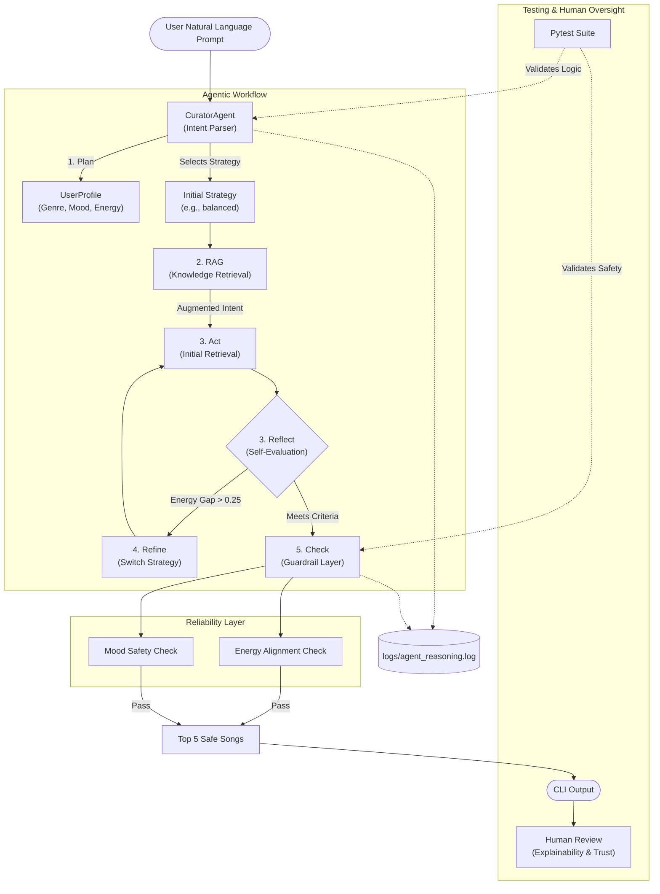

# System Architecture Diagram (Mermaid)

Copy and paste the following code into the [Mermaid Live Editor](https://mermaid.live/), then export it as a PNG and save it as `system_architecture.png` in this directory to avoid account limits.

